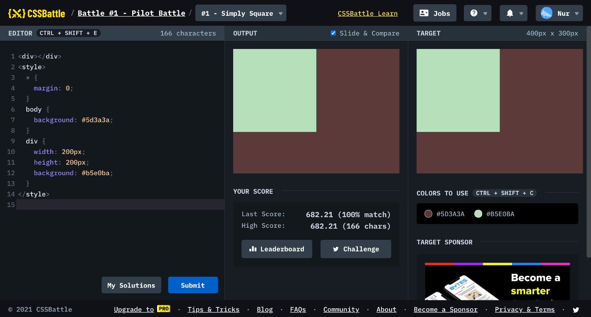

# Battle #1 - Pilot Battle

## #1 - Simple Square

[Link to the problem](https://cssbattle.dev/play/1)



```html
<!-- my solution -->
<div></div>
<style>
  body {
    margin: 0;
    background: #5d3a3a;
  }
  div {
    width: 200px;
    height: 200px;
    background: #b5e0ba;
  }
</style>

<!-- <div><style>body{margin:0;background:#5d3a3a}div{width:200px;height:200px;background:#b5e0ba -->
```

```html
<style>
  html {
    box-shadow: -211q -106q #5d3a3a inset;
    background: #b5e0ba;
  }
</style>
<!-- box-shadow, q, inset -->
<!-- <style>html{box-shadow:-211q -106q#5d3a3a inset;background:#b5e0ba -->
```

```html
<a style="box-shadow: 0 0 0 2in #b5e0ba, 0 0 0 9in #5d3a3a;"></a>
<!-- <a style=box-shadow:0+0+0+2in#b5e0ba,0+0+0+9in#5d3a3a>
  most of inline elements will do: a, img, span -->
```
