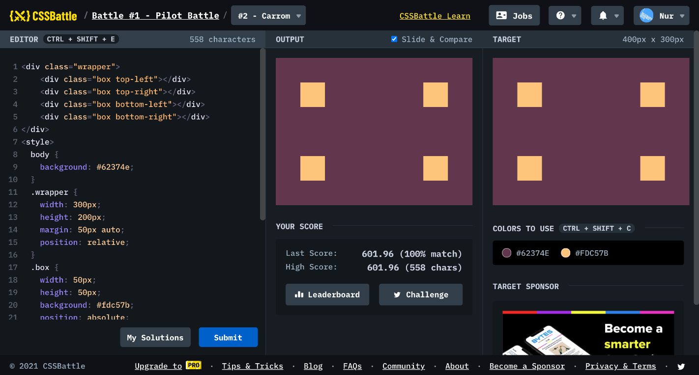

# Battle #1 - Pilot Battle

## #2 - Carrom

[Link to the problem](https://cssbattle.dev/play/2)



```html
<div class="wrapper">
  <div class="box top-left"></div>
  <div class="box top-right"></div>
  <div class="box bottom-left"></div>
  <div class="box bottom-right"></div>
</div>
<style>
  body {
    background: #62374e;
  }
  .wrapper {
    width: 300px;
    height: 200px;
    margin: 50px auto;
    position: relative;
  }
  .box {
    width: 50px;
    height: 50px;
    background: #fdc57b;
    position: absolute;
  }
  .box.top-right {
    right: 0;
  }
  .box.bottom-left {
    bottom: 0;
  }
  .box.bottom-right {
    bottom: 0;
    right: 0;
  }
</style>
```

```html
<!-- my solution -->
<div></div>
<div></div>
<div></div>
<div></div>
<style>
  body {
    margin: 0;
    background: #62374e;
    display: flex;
    flex-wrap: wrap;
    justify-content: space-between;
  }
  div {
    width: 50px;
    height: 50px;
    background: #fdc57b;
    margin: 50px;
  }
</style>

<!-- <div></div><div></div><div></div><div></div><style>body{margin:0;background:#62374e;display:flex;flex-wrap:wrap;justify-content:space-between}div{width:50px;height:50px;background:#fdc57b;margin:50px; -->
```

```html
<style>
  * {
    width: 50;
    height: 50;
    background: #fdc57b;
    margin: 25 25;
    box-shadow: 250px 0 #fdc57b, 250px 150px #fdc57b, 0 150px #fdc57b, 0 0 0
        300px #62374e;
  }
</style>

<!-- <style>*{width:50;height:50;background:#fdc57b;margin:25 25;box-shadow:250px 0#fdc57b,250px 150px#fdc57b,0 150px#fdc57b,0 0 0 300px#62374e -->
```

```html
<body
  bgcolor="#62374e"
  style="margin: 0 50; border:dashed 50px #fdc57b; clip-path: inset(50px 0)"
></body>
<!-- <body bgcolor=#62374e style=margin:0+50;border:dashed+50px#fdc57b;clip-path:inset(50px+0> -->
```

```html
<div></div>
<div></div>
<div></div>
<div></div>
<style>
  body {
    background-color: #62374e;
    margin: 50;
    display: grid;
    grid-template-columns: auto auto;
    grid-gap: 100px 200px;
  }
  div {
    width: 50;
    height: 50;
    background-color: #fdc57b;
  }
</style>
```
