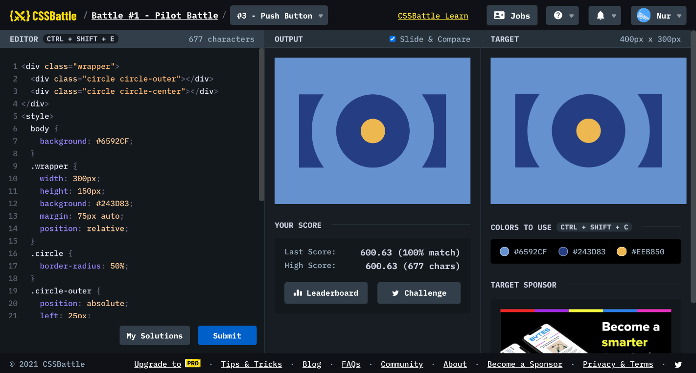

# Battle #1 - Pilot Battle

## #3 - Push Button

[Link to the problem](https://cssbattle.dev/play/3)



```html
<div class="wrapper">
  <div class="circle circle-outer"></div>
  <div class="circle circle-center"></div>
</div>
<style>
  body {
    background: #6592cf;
  }
  .wrapper {
    width: 300px;
    height: 150px;
    background: #243d83;
    margin: 75px auto;
    /* margin처리 */
    position: relative;
  }
  .circle {
    border-radius: 50%;
  }
  .circle-outer {
    position: absolute;
    left: 25px;
    top: -50px;
    width: 250px;
    height: 250px;
    background: transparent;
    box-sizing: border-box;
    border: 50px solid #6592cf;
    /* "border-width: 50px" */
  }
  .circle-center {
    position: absolute;
    width: 50px;
    height: 50px;
    left: 125px;
    top: 50px;
    background: #eeb850;
  }
</style>
```

```html
<!-- my solution -->
<div id="a">
  <div id="b">
    <div id="c">
      <div id="d"></div>
    </div>
  </div>
</div>

<style>
  body {
    margin: 0;
    background: #6592cf;
  }
  #a {
    position: absolute;
    top: 75px;
    left: 50px;
    width: 300px;
    height: 150px;
    background: #243d83;
  }
  #b {
    position: absolute;
    top: -50px;
    left: 25px;
    width: 250px;
    height: 250px;
    background: #6592cf;
    border-radius: 50%;
  }
  #c {
    position: absolute;
    top: 50px;
    left: 50px;
    width: 150px;
    height: 150px;
    background: #243d83;
    border-radius: 50%;
  }
  #d {
    position: absolute;
    top: 50px;
    left: 50px;
    width: 50px;
    height: 50px;
    background: #eeb850;
    border-radius: 50%;
  }
</style>
```

```html
<p></p>
<p i></p>
  <style>
    p {
      width: 90;
      height: 150;
      background: #243d83;
      margin: 75 42;
      box-shadow: 210px 0 #243D83, 0 0 0 300px #6592CF;
    }
    [i] {
      width: 50;
      height: 50;
      background: #eeb850;
      border-radius: 50%;
      margin: -175 167;
      box-shadow: 0 0 0 50px #243D83, 0 0 0 100px #6592CF;
    }
  </style>

  <!-- <p><p i><style>p{width:90;height:150;background:#243D83;margin:75 42;box-shadow:210px 0#243D83,0 0 0 300px#6592CF}[i]{width:50;height:50;background:#EEB850;border-radius:50%;margin:-175 167;box-shadow:0 0 0 50px#243D83,0 0 0 100px#6592CF -->
</p>
```

```html
<style>
  * {
    margin: 75 50;
    background: radial-gradient(
        circle,
        #eeb850 25px,
        0,
        #243d83 75px,
        0,
        transparent 125px,
        #243d83 125px
      ) no-repeat#6592CF;
  }
</style>
<!-- <style>*{margin:75 50;background:radial-gradient(circle,#eeB850 25px,0,#243D83 75px,0,transparent 125px,#243D83 125px)no-repeat#6592CF} -->
```

```html
<div i></div>
<div b>
  <div>
    <div s>
      <div>
        <div e></div>
        <style>
          body {
            background: #6592cf;
            display: flex;
            justify-content: center;
            align-items: center;
          }
          div[i] {
            background: #243d83;
            width: 300;
            height: 150;
          }
          div[b] {
            width: 250;
            height: 250;
            position: absolute;
            z-index: 10;
            background: #6592cf;
            border-radius: 100%;
          }
          div[s] {
            width: 150;
            height: 150;
            position: absolute;
            top: 50%;
            left: 50%;
            transform: translate(-50%, -50%);
            background: #243d83;
            border-radius: 100%;
          }
          div[e] {
            width: 50;
            height: 50;
            position: absolute;
            top: 50%;
            left: 50%;
            transform: translate(-50%, -50%);
            z-index: 25;
            background: #eeb850;
            border-radius: 100%;
          }
        </style>
      </div>
    </div>
  </div>
</div>
```
